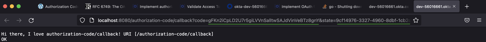
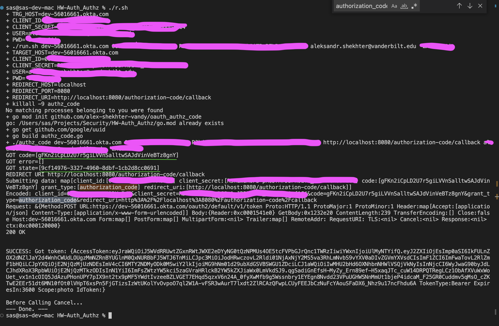

# OAuth Authroization Code example

This code has been implemented and tested using Mac OS, so for other OSes results can vary.

In order to hide a sensetive data special ```r.sh``` script has been used. It calls ```./run.sh``` code and just passes secure parameters to it.

To run an example one will need either to edit ```./r.sh``` 

```
#!/bin/sh -x

TRG_HOST=""
CLIENT_ID=""
CLIENT_SECRET=""
USER=""
PWD=""

./run.sh $TRG_HOST $CLIENT_ID $CLIENT_SECRET $USER $PWD
```

Or run ```./run.sh``` with approapriate parameters from the command line.

## Implementation notes.

Solution is using shell script to simplify compilation and run process of the main piece of code ```authz_code```

Main code is written using Go langauge and has the following flow:
1) start browser with the authz request. We need browser, since JS is involved in this flow.
2) after that start local web server, listening for redirects from the Authrization server
3) local web server checks for the state and if URL and state are good posts token request to the authz server
4) In case token is obtained, local server is shutdown.

### Screenshot after browser redirected to the local server


### Screenshot of the debug information to the console


